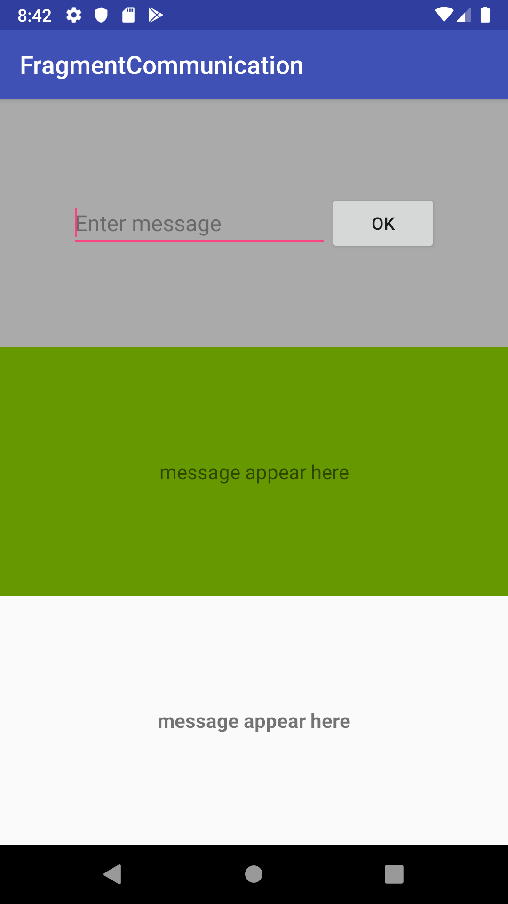
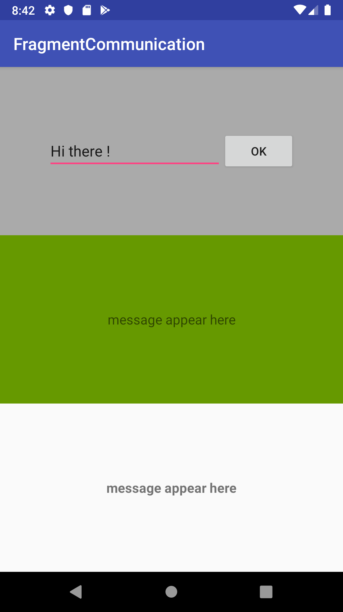
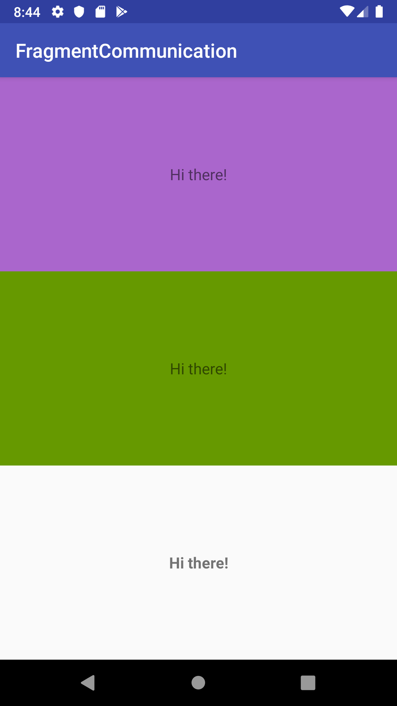

# FragmentCommunication
Shows communication between fragment to fragment and fragment to activity.

##### <b> Attaching some screenshots: </b> 

  

So here we have one activity with 3 fragments :
- FragmentA (Grey b/g)
- FragmentB (Green b/g)
- FragmentC (Purple b/g)
